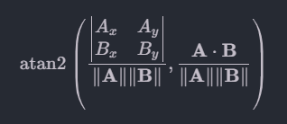

# Vepley AI model details

## Model details

### Input
X: The angle of the joint in the frame.
Calculated by the following formula:
```
np.math.atan2(np.linalg.det([landmark1, landmark2]), np.dot(landmark1, landmark2))
```
Which is the angle between the two vectors.


$$\mathrm{atan2}\left(\frac{\begin{vmatrix} A_x & A_y \\ B_x & B_y \end{vmatrix}}{\lVert\mathbf{A}\rVert\lVert\mathbf{B}\rVert}, \frac{\mathbf{A}\cdot\mathbf{B}}{\lVert\mathbf{A}\rVert\lVert\mathbf{B}\rVert}\right)$$



We calculate the following angles:
```python
PARSE_LANDMARKS_JOINTS = [    
    [0, 1], [1, 2], [2, 3], [3, 4], # thumb
    [0, 5],[5, 6], [6, 7], [7, 8], # index finger
    [5, 9],[9,10],[10, 11], [11, 12],# middle finger
    [9, 13],[13, 14],[14, 15],[15, 16], # ring finger
    [13, 17],  [17, 18], [18, 19], [19,20]   # little finger
]
```

With the number above is the index of the joint in the frame.


By calculating the angle between the joints we get the input with 20 features.


Y : the label of the action.
```python
Actions = ['Idle',
           'Pickup_item',
           'Use_item',
           'Aim',
           'Shoot'
           ]
```
### Model
We use a simple deep neural network with 4 layers.
```python
LAYERS = [512, 256, 256, len(Actions)]
```
Then we use the following activation function:
```python
ACTIVATION = [ "relu", "relu", "relu", "sigmoid"]
```

The model is trained using keras library with the following parameters:
```python
EPOCHS = 100
BATCH_SIZE = 32
```

### Output
The output is the probability of the action.


## Dataset details

Total of 5 people.

Each frame has 2D coordinates of 21 joints.

__Batch 1__: VepleyAI_dataset_Dataset_full_1
- Idle: 800
- Pickup_item: 798
- Use_item: 798
- Aim: 798
- Shoot: 800
- total: 3994

__Batch 2__: VepleyAI_dataset_Dataset_full_2
- Idle: 800
- Pickup_item: 798
- Use_item: 800
- Aim: 798
- Shoot: 798
- total: 3994

__Batch 3__: VepleyAI_dataset_Dataset_full_3
- Idle: 798
- Pickup_item: 798
- Use_item: 800
- Aim: 798
- Shoot: 800
- total: 3994

__Batch 4__: VepleyAI_dataset_Dataset_full_4
- Idle: 800
- Pickup_item: 800
- Use_item: 798
- Aim: 798
- Shoot: 798
- total: 3994

__Batch 5__: VepleyAI_dataset_Dataset_full_5
- Idle: 798
- Pickup_item: 798
- Use_item: 798
- Aim: 798
- Shoot: 798
- total: 3990

__Batch 6__: VepleyAI_dataset_Dataset_full_6
- Idle: 796
- Pickup_item: 798
- Use_item: 798
- Aim: 798
- Shoot: 798
- total: 3988

__Batch 7__: VepleyAI_dataset_Dataset_full_7
- Idle: 800
- Pickup_item: 800
- Use_item: 798
- Aim: 798
- Shoot: 798
- total: 3994

__Batch 8__: VepleyAI_dataset_Dataset_full_8
- Idle: 798
- Pickup_item: 798
- Use_item: 798
- Aim: 798
- Shoot: 798
- total: 3990

__Batch 9__: VepleyAI_dataset_Dataset_full_9
- Idle: 798
- Pickup_item: 798
- Use_item: 798
- Aim: 798
- Shoot: 798
- total: 3990

__Batch 10__: VepleyAI_dataset_DS_01
- Idle: 798
- Pickup_item: 798
- Use_item: 798
- Aim: 798
- Shoot: 798
- total: 3990

__Batch 11__: VepleyAI_dataset_DS_02
- Idle: 798
- Pickup_item: 798
- Use_item: 800
- Aim: 800
- Shoot: 800
- total: 3996

